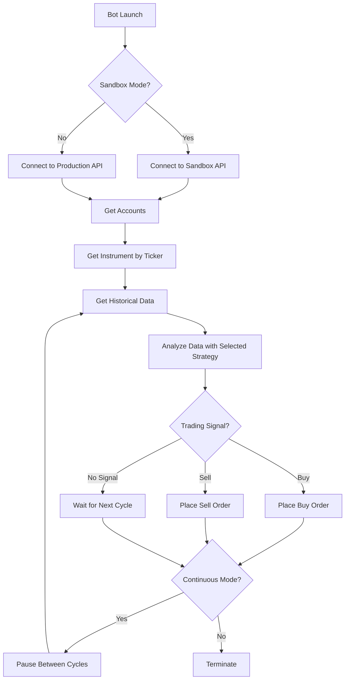
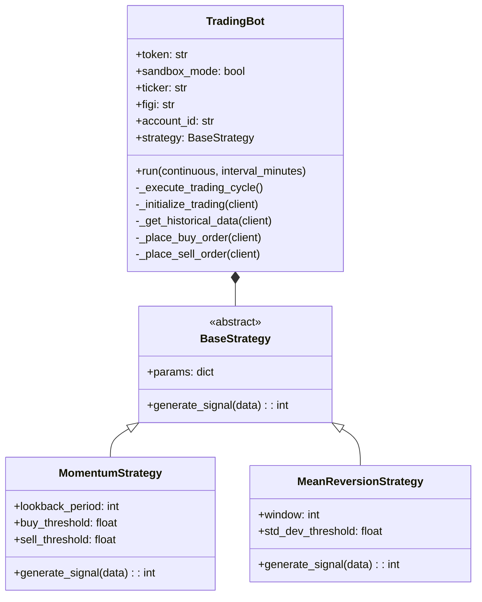
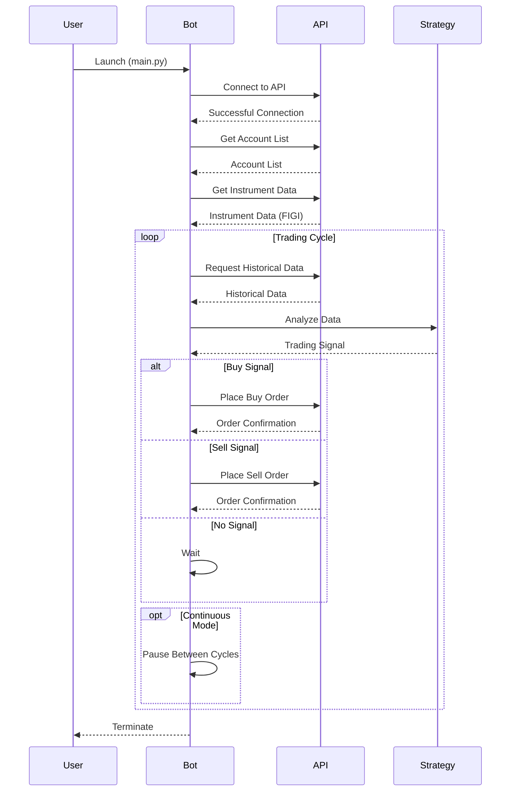

# Invest-T: Tinkoff Invest Trading Bot

An automated trading bot for short-term trading using the Tinkoff Invest API.

## Features

- Integration with Tinkoff Invest API
- Support for two modes: production and sandbox
- Two trading strategies: momentum and mean reversion
- Customizable trading strategy parameters
- Continuous trading capability with configurable intervals
- Detailed operation logging

## Requirements

- Python 3.8+
- Tinkoff Invest API access token

## Installation

1. Clone the repository:
```bash
git clone https://github.com/yourusername/invest-t.git
cd invest-t
```

2. Create and activate a virtual environment:
```bash
python -m venv .venv
source .venv/bin/activate  # for Linux/Mac
# or .venv\Scripts\activate for Windows
```

3. Install dependencies:
```bash
pip install -r requirements.txt
```

4. Create a .env file and add your token:
```
TINKOFF_TOKEN=your_token
```

## Configuration

The main settings are in the `config.py` file:

- `SANDBOX_MODE`: sandbox mode (True/False)
- `TICKER`: instrument ticker for trading
- `STRATEGY`: strategy to use ('simple_momentum' or 'mean_reversion')
- `CANDLE_INTERVAL`: candle interval ('1m', '5m', '15m', '1h')
- `LOOKBACK_PERIOD`: number of candles for analysis
- `BUY_THRESHOLD` and `SELL_THRESHOLD`: threshold values for buy/sell signals
- `POSITION_SIZE`: position size (fraction of available funds)

## Usage

### Basic Launch

To run the bot with default settings:

```bash
python main.py
```

### Advanced Options

The bot supports several command-line arguments:

```bash
python main.py --strategy mean_reversion --ticker AAPL --interval 5m --sandbox --continuous --cycle-minutes 30
```

Available parameters:
- `--strategy`: trading strategy ('simple_momentum' or 'mean_reversion')
- `--ticker`: instrument ticker
- `--interval`: candle interval ('1m', '5m', '15m', '1h')
- `--sandbox`: use sandbox mode
- `--continuous`: run in continuous mode
- `--cycle-minutes`: minutes between trading cycles (default 15)

## Project Structure

- `main.py`: main entry point with extended functionality
- `bot.py`: simplified bot version
- `config.py`: configuration parameters
- `strategies/`: trading strategy modules
  - `base_strategy.py`: base class for all strategies
  - `momentum_strategy.py`: price momentum-based strategy
  - `mean_reversion_strategy.py`: mean reversion-based strategy
- `utils/`: helper functions
  - `helpers.py`: utilities for data processing and indicators

## Process Flow Diagram

Below is a diagram of the main processes of the trading bot:



## Class Diagram



## Sequence Diagram


