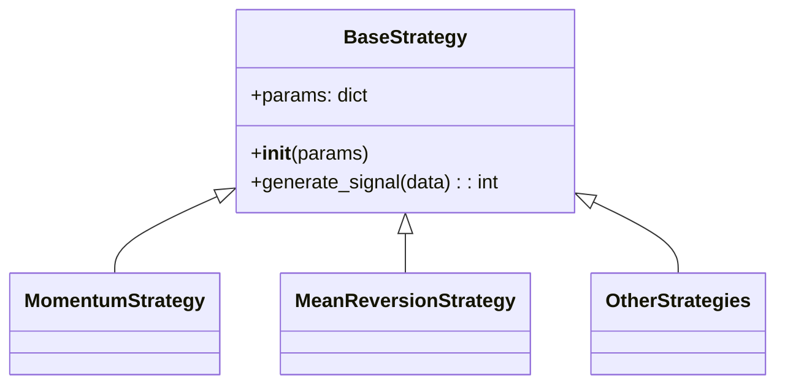

# Base Strategy

## Overview

The Base Strategy is an abstract class that serves as a foundation for all trading strategies in the Invest-T application. It defines the interface that all concrete strategy implementations must follow.

## Purpose

This abstract base class:
- Provides a consistent interface for all trading strategies
- Ensures that all strategies implement the required methods
- Simplifies the process of adding new strategies
- Allows for polymorphic treatment of different strategies in the main application

## Class Structure



## Interface

The BaseStrategy defines the following interface:

- `__init__(params=None)`: Constructor that accepts optional strategy parameters
- `generate_signal(data)`: Abstract method that must be implemented by subclasses
  - Takes price data as input
  - Returns an integer signal:
    - `1` for a BUY signal
    - `-1` for a SELL signal
    - `0` for no action (HOLD)

## Implementation Requirements

When implementing a new strategy that inherits from BaseStrategy, you must:

1. Call the parent constructor using `super().__init__(params)`
2. Override the `generate_signal(data)` method with your custom logic
3. Return appropriate signal values (1, -1, or 0)

## Example Usage

```python
from strategies.base.base_strategy import BaseStrategy

class YourCustomStrategy(BaseStrategy):
    def __init__(self, params=None):
        super().__init__(params)
        # Initialize your custom parameters
        self.your_param = self.params.get('your_param', default_value)
    
    def generate_signal(self, data):
        # Implement your custom logic here
        if your_buy_condition:
            return 1  # BUY
        elif your_sell_condition:
            return -1  # SELL
        else:
            return 0  # HOLD/No action
```

## Integration

To integrate your new strategy into the trading bot:

1. Create a new file for your strategy class that inherits from BaseStrategy
2. Implement the required methods
3. Update the main application to recognize and use your new strategy

This abstract base class approach allows for easy expansion of the trading system with new strategies while maintaining a consistent interface.
