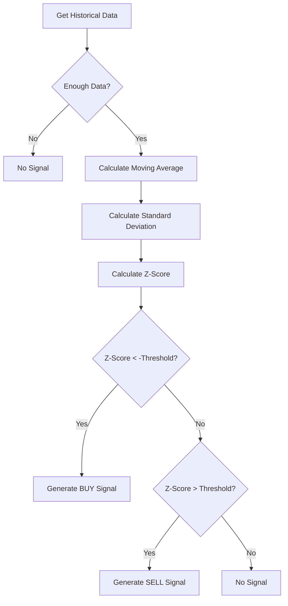
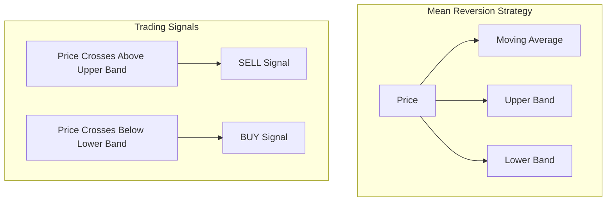

# Mean Reversion Trading Strategy

## Overview

The Mean Reversion Trading Strategy is based on the principle that asset prices tend to revert to their mean or average value over time. This strategy identifies when prices have deviated significantly from their historical average and generates signals based on the expectation that they will return to that average.

## How It Works

1. **Moving Average Calculation**: The strategy calculates a moving average of the price over a specified window.
2. **Standard Deviation Calculation**: It calculates the standard deviation of price from the moving average.
3. **Z-Score Determination**: The current price's deviation from the mean is expressed as a z-score (number of standard deviations).
4. **Signal Generation**:
   - If the price is significantly below the average (negative z-score beyond threshold), generate a BUY signal
   - If the price is significantly above the average (positive z-score beyond threshold), generate a SELL signal
   - If the price is within normal range, no action is taken

## Parameters

The strategy accepts the following configurable parameters:

| Parameter | Description | Default Value |
|-----------|-------------|---------------|
| `window` | Number of candles for moving average calculation | 20 |
| `std_dev_threshold` | Number of standard deviations that triggers a signal | 1.5 |

## Process Flow



## Visual Representation



## Example Calculation

For example, with the following settings:
- `window`: 20
- `std_dev_threshold`: 1.5

And given the following scenario:
- Moving average of price: $100
- Standard deviation: $5
- Current price: $92

The z-score calculation would be:
```
Z-Score = (Current Price - Moving Average) / Standard Deviation
Z-Score = ($92 - $100) / $5 = -1.6
```

Since -1.6 < -1.5 (beyond the threshold in negative direction), a BUY signal would be generated.

## Strengths

- Effective in range-bound or oscillating markets
- Based on statistical principles
- Captures reversal points in overextended price movements

## Limitations

- Can generate incorrect signals during strong trends
- Requires sufficient historical data
- Threshold selection is critical to performance

## Usage

```python
from strategies.mean_reversion.mean_reversion_strategy import MeanReversionStrategy

# Create strategy with custom parameters
strategy = MeanReversionStrategy({
    'window': 30,
    'std_dev_threshold': 2.0
})

# Generate signal from historical data
signal = strategy.generate_signal(historical_data)

# Interpret signal
if signal == 1:
    print("BUY signal generated")
elif signal == -1:
    print("SELL signal generated")
else:
    print("No trading signal")
```
