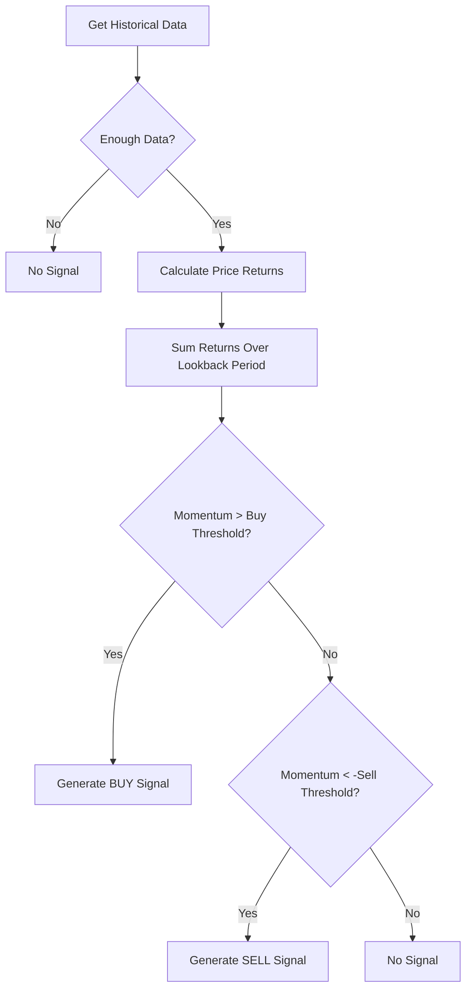

# Momentum Trading Strategy

## Overview

The Momentum Trading Strategy is based on the principle that price movements tend to continue in the same direction. This strategy analyzes recent price changes to detect sustained movements and generates trading signals accordingly.

## How It Works

1. **Price Momentum Calculation**: The strategy calculates momentum by summing the price returns over a specified lookback period.
2. **Signal Generation**: 
   - If momentum exceeds the buy threshold, generate a BUY signal
   - If momentum falls below the negative sell threshold, generate a SELL signal
   - Otherwise, no trading action is taken

## Parameters

The strategy accepts the following configurable parameters:

| Parameter | Description | Default Value |
|-----------|-------------|---------------|
| `lookback_period` | Number of candles to analyze | 14 |
| `buy_threshold` | Minimum momentum value required for a buy signal | 0.005 (0.5%) |
| `sell_threshold` | Minimum negative momentum value required for a sell signal | 0.005 (0.5%) |

## Process Flow



## Example Calculation

For example, with the following settings:
- `lookback_period`: 14
- `buy_threshold`: 0.005
- `sell_threshold`: 0.005

And given the following price returns over the lookback period:
```
[0.001, 0.002, -0.001, 0.003, 0.001, 0.002, -0.002, 0.001, 0.004, -0.001, 0.003, 0.002, -0.001, 0.002]
```

The momentum calculation would be:
```
Momentum = 0.001 + 0.002 + (-0.001) + 0.003 + 0.001 + 0.002 + (-0.002) + 0.001 + 0.004 + (-0.001) + 0.003 + 0.002 + (-0.001) + 0.002 = 0.016 (1.6%)
```

Since 0.016 > 0.005 (buy threshold), a BUY signal would be generated.

## Strengths

- Simple to understand and implement
- Works well in trending markets
- Adaptable through parameter adjustment

## Limitations

- May generate false signals in choppy or sideways markets
- Vulnerable to sudden price reversals
- Timing of entry/exit can be challenging

## Usage

```python
from strategies.momentum.momentum_strategy import MomentumStrategy

# Create strategy with custom parameters
strategy = MomentumStrategy({
    'lookback_period': 10,
    'buy_threshold': 0.01,
    'sell_threshold': 0.008
})

# Generate signal from historical data
signal = strategy.generate_signal(historical_data)

# Interpret signal
if signal == 1:
    print("BUY signal generated")
elif signal == -1:
    print("SELL signal generated")
else:
    print("No trading signal")
```
